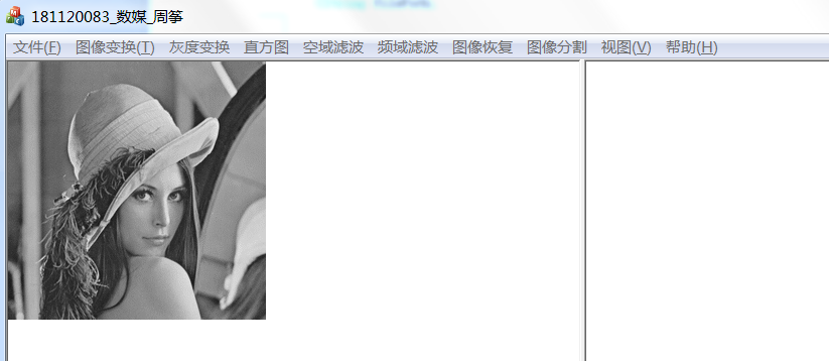
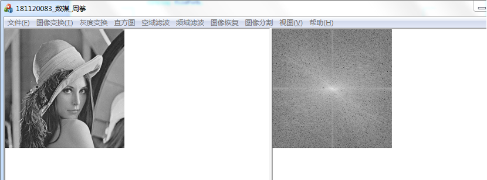
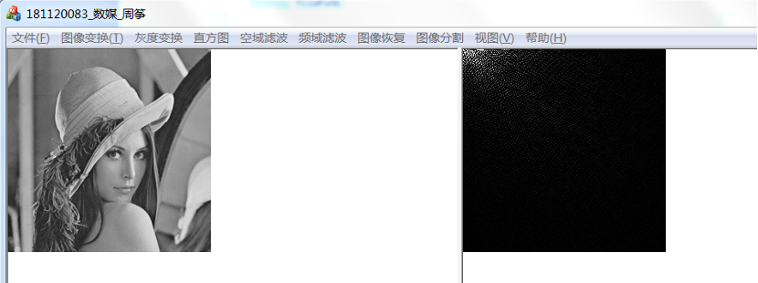
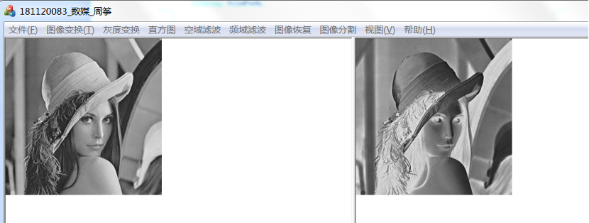
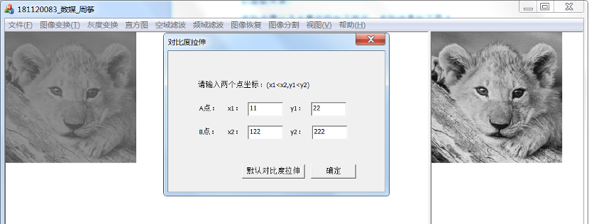
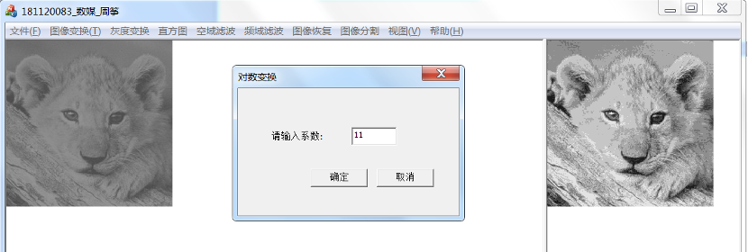
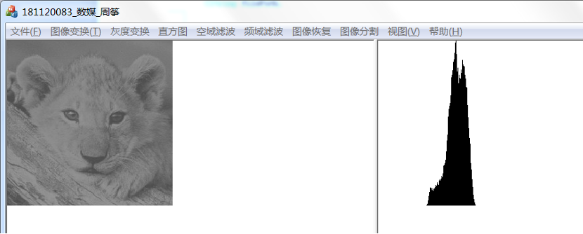
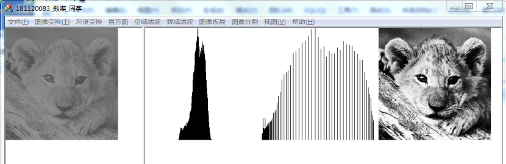
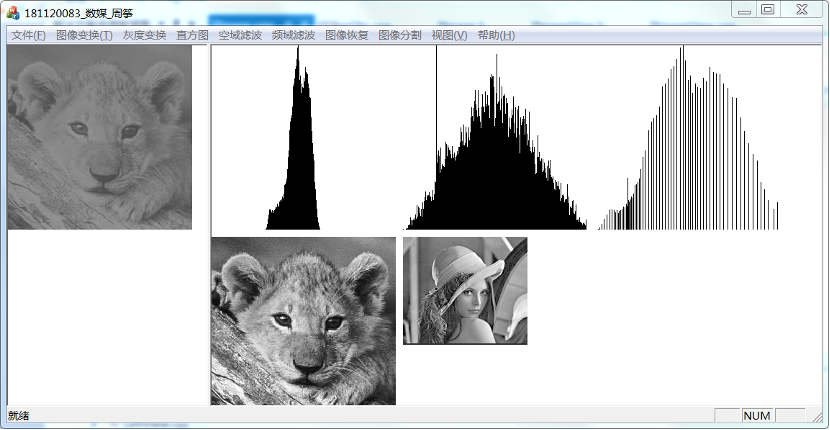

### 1, grey image

### 2, DFT, 

### 3, DCT

### 4, inverse 

### 5, piecewise linear transformation

### 6, log transformation

### 7, histogram

### 8, equalization

### 9, specification

